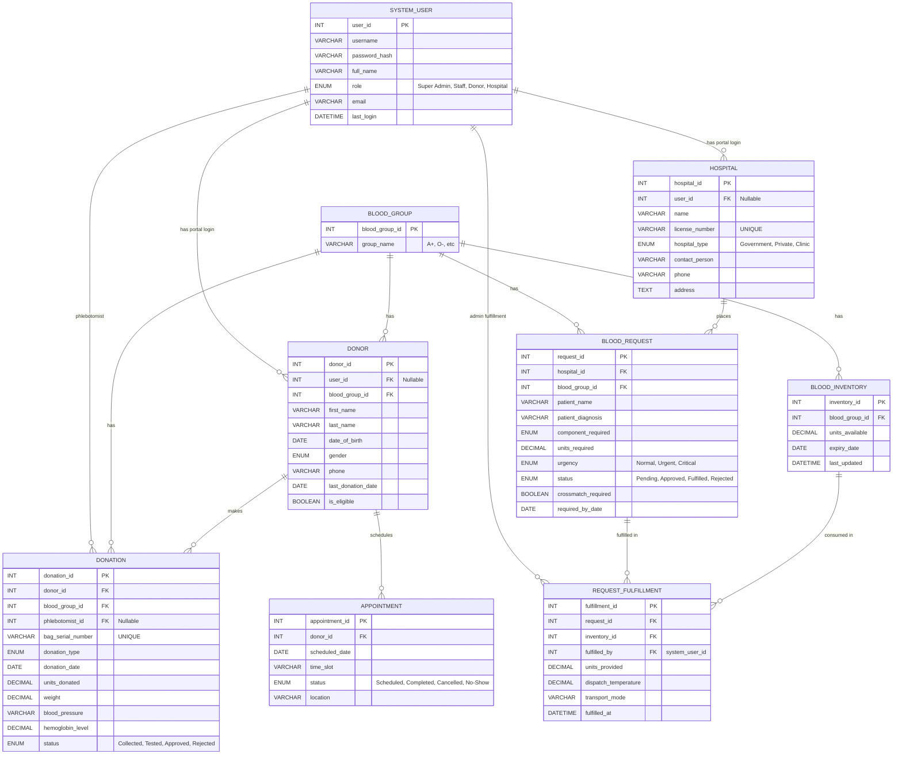

# Blood Bank System - Database ERD

```mermaid
erDiagram
    SYSTEM_USER {
        INT user_id PK
        VARCHAR username
        VARCHAR password_hash
        VARCHAR full_name
        ENUM role "Super Admin, Staff, Donor, Hospital"
        VARCHAR email
        DATETIME last_login
    }

    BLOOD_GROUP {
        INT blood_group_id PK
        VARCHAR group_name "A+, O-, etc"
    }

    DONOR {
        INT donor_id PK
        INT user_id FK "Nullable"
        INT blood_group_id FK
        VARCHAR first_name
        VARCHAR last_name
        DATE date_of_birth
        ENUM gender
        VARCHAR phone
        DATE last_donation_date
        BOOLEAN is_eligible
    }

    HOSPITAL {
        INT hospital_id PK
        INT user_id FK "Nullable"
        VARCHAR name
        VARCHAR license_number "UNIQUE"
        ENUM hospital_type "Government, Private, Clinic"
        VARCHAR contact_person
        VARCHAR phone
        TEXT address
    }

    BLOOD_INVENTORY {
        INT inventory_id PK
        INT blood_group_id FK
        DECIMAL units_available
        DATE expiry_date
        DATETIME last_updated
    }

    DONATION {
        INT donation_id PK
        INT donor_id FK
        INT blood_group_id FK
        INT phlebotomist_id FK "Nullable"
        VARCHAR bag_serial_number "UNIQUE"
        ENUM donation_type
        DATE donation_date
        DECIMAL units_donated
        DECIMAL weight
        VARCHAR blood_pressure
        DECIMAL hemoglobin_level
        ENUM status "Collected, Tested, Approved, Rejected"
    }

    BLOOD_REQUEST {
        INT request_id PK
        INT hospital_id FK
        INT blood_group_id FK
        VARCHAR patient_name
        VARCHAR patient_diagnosis
        ENUM component_required
        DECIMAL units_required
        ENUM urgency "Normal, Urgent, Critical"
        ENUM status "Pending, Approved, Fulfilled, Rejected"
        BOOLEAN crossmatch_required
        DATE required_by_date
    }

    REQUEST_FULFILLMENT {
        INT fulfillment_id PK
        INT request_id FK
        INT inventory_id FK
        INT fulfilled_by FK "system_user_id"
        DECIMAL units_provided
        DECIMAL dispatch_temperature
        VARCHAR transport_mode
        DATETIME fulfilled_at
    }

    APPOINTMENT {
        INT appointment_id PK
        INT donor_id FK
        DATE scheduled_date
        VARCHAR time_slot
        ENUM status "Scheduled, Completed, Cancelled, No-Show"
        VARCHAR location
    }

    %% Relationships
    SYSTEM_USER ||--o{ DONOR : "has portal login"
    SYSTEM_USER ||--o{ HOSPITAL : "has portal login"
    SYSTEM_USER ||--o{ DONATION : "phlebotomist"
    SYSTEM_USER ||--o{ REQUEST_FULFILLMENT : "admin fulfillment"
    
    BLOOD_GROUP ||--o{ DONOR : "has"
    BLOOD_GROUP ||--o{ BLOOD_INVENTORY : "has"
    BLOOD_GROUP ||--o{ DONATION : "has"
    BLOOD_GROUP ||--o{ BLOOD_REQUEST : "has"

    DONOR ||--o{ DONATION : "makes"
    DONOR ||--o{ APPOINTMENT : "schedules"

    HOSPITAL ||--o{ BLOOD_REQUEST : "places"

    BLOOD_REQUEST ||--o{ REQUEST_FULFILLMENT : "fulfilled in"
    BLOOD_INVENTORY ||--o{ REQUEST_FULFILLMENT : "consumed in"
```
